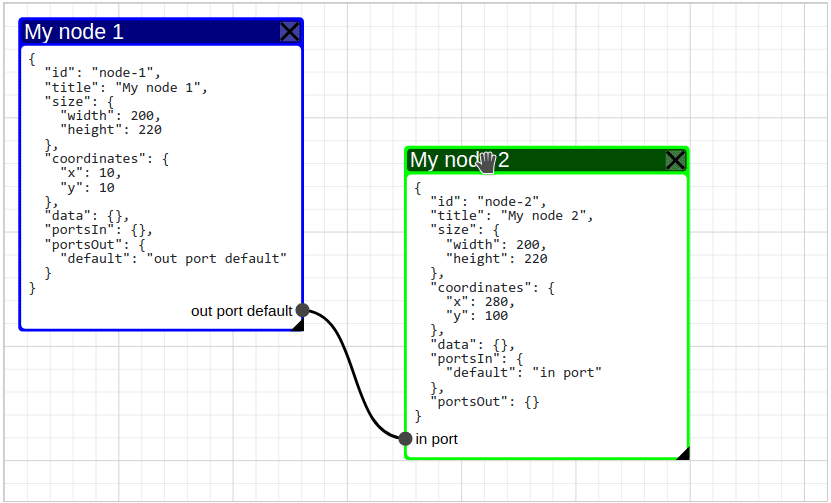

# Vue diagram editor


Please read the documentation [https://vue-diagram-editor.js.org](https://vue-diagram-editor.js.org) (includes demo)



## Introduction

The main purpose of this component is to make it possible to use any component within each node of the diagram.

### Vue Diagram Editor features:
* **scoped-slot for node**
* ripple (pulsable) node
* any number of instances per page
* customizable node color
* customizable node pulse color

## Getting Started with Vue Diagram Editor

It's recommended to install `vue-diagram-editor` via npm, and build your app using a bundler like webpack:
```bash
npm install vue-diagram-editor
```

**Requires Vue 2.6+**

### Simple example
```vue
<template>
  <VueDiagramEditor
    ref="diagram"
    :node-color="nodeColor"
    :node-pulsable="nodePulsable"
  >
    <pre slot="node" slot-scope="{node}">{{ format(node) }}</pre>
  </VueDiagramEditor>
</template>

<script>
import VueDiagramEditor from 'vue-diagram-editor';
import 'vue-diagram-editor/dist/vue-diagram-editor.css';

export default {
  name: 'simple-example',
  components: {
    VueDiagramEditor
  },
  data: () => ({
    nodes: {
      'node-1': {
        id: 'node-1',
        title: 'My node 1',
        size: {
          width: 200,
          height: 220
        },
        portsOut: {
          default: 'out port default'
        }
      },
      'node-2': {
        id: 'node-2',
        title: 'My node 2',
        size: {
          width: 200,
          height: 220
        },
        coordinates: {
          x: 280,
          y: 100
        },
        portsIn: {
          default: 'in port'
        }
      },
    },
    links: {
      'link-1': {
        id: 'link-1',
        start_id: 'node-1',
        start_port: 'default',
        end_id: 'node-2',
        end_port: 'default'
      }
    }
  }),
  mounted() {
    this.init();
  },
  methods: {
    init() {
      this.$refs.diagram.setModel({
        nodes: this.nodes,
        links: this.links
      });
    },
    format(node) {
      return JSON.stringify(node, null, 2);
    },
    nodeColor(node) {
      if (node.coordinates.x > 200) {
        return '#0f0';
      }
      if (node.coordinates.y > 200) {
        return '#f00';
      }

      return '#00f';
    },

    nodePulsable(node) {
      return node.coordinates.y > 200;
    }
  }
};
</script>
```

If you just don't want to use webpack or any other bundlers, you can simply include the standalone UMD build in your page. In this way, make sure Vue as a dependency is included before vue-diagram-editor.
```html
<!DOCTYPE html>
<html lang="en">
<head>
  <meta charset="UTF-8">
  <title>Title</title>
  <script src="https://cdn.jsdelivr.net/npm/vue@2.6"></script>
  <script src="https://cdn.jsdelivr.net/npm/vue-diagram-editor@^1/dist/vue-diagram-editor.umd.min.js"></script>
  <link rel="stylesheet" href="https://cdn.jsdelivr.net/npm/vue-diagram-editor@^1/dist/vue-diagram-editor.min.css">
</head>
<body>
  <div id="app">
    <diagram-editor ref="diagram"></diagram-editor>
  </div>
  <script>
    // register the component
    Vue.component('diagram-editor', VueDiagramEditor.Diagram);
    new Vue({
      el: '#app',
      data: {
        nodes: {
          'node-1': {
            id: 'node-1',
            title: 'My node 1',
            size: {
              width: 200,
              height: 220
            },
            portsOut: {
              default: ''
            }
          },
          'node-2': {
            id: 'node-2',
            title: 'My node 2',
            size: {
              width: 200,
              height: 220
            },
            coordinates: {
              x: 280,
              y: 100
            },
            portsIn: {
              default: 'in port'
            }
          },
        },
        links: {
          'link-1': {
            id: 'link-1',
            start_id: 'node-1',
            start_port: 'default',
            end_id: 'node-2',
            end_port: 'default'
          }
        }
      },
      mounted() {
        this.init();
      },
      methods: {
        init() {
          this.$refs.diagram.setModel({
            nodes: this.nodes,
            links: this.links
          });
        }
      }
    });
  </script>
</body>
</html>
```

## API
### [Node](#node)
|  Prop  | Required | Default | Description |
|:-------|:---------|:--------|:------------|
| `id` | no | generated [ulid](https://github.com/ulid/javascript "ulid") identifier | Unique identifier of node |
| `title` | yes | - | Title of node |
| `coordinates` | no | `{x:10,y:10}` | Node coordinates object. Must contain this two numerical properties: `x` and `y` |
| `size` | no | `{width:150, height:150}` | Node size object. Must contain this two numerical properties: `width` and `height` |
| `portsIn` | no | `{}` | The node's incoming ports object. Object keys are port names and values are port headers |
| `portsOut` | no | `{}` | The node's outgoing ports object. Object keys are port names and values are port headers |
| `data` | no | `{}` | Custom data object. May be useful when handling events |

### [Link](#link)
|  Prop  | Required | Type/Default | Description |
|:-------|:---------|:-------------|:------------|
| `id` | no | String / generated [ulid](https://github.com/ulid/javascript "ulid") identifier | Unique identifier of link |
| `start_id` | yes | String / - | ID of the node from which this link starts |
| `start_port` | no | String / `"default"` | The name of the outgoing port of the node from which this link begins |
| `end_id` | yes | String / - | ID of the node where this link ends |
| `end_port` | no | String / `"default"` | The name of the incoming port of the node where this link ends |

### [Props](#props)

| Name | Type / Default | Description |
| --- | --- | --- |
| `height` | **Type**: Number<br>**Default**: `500` | Block height with Vue-Diagram-Editor |
| `zoomEnabled` | **Type**: Boolean<br>**Default**: `true` | Allows to scale the diagram |
| `nodeColor` | **Type**: Function: String<br>**Default**: `node => "#66cc00"` | The function takes object of `Node` as parameter and must return a string with a hexadecimal color representation. Avoid heavy computation in this function |
| `nodeDeletable` | **Type**: Function: Boolean<br>**Default**: `node => true` | Shows or hides the delete node button |
| `nodePulsable` | **Type**: Function: Boolean<br>**Default**: `node => false` | Enables or disables the ripple of a specific node. Avoid heavy computation in this function |
| `nodePulseColor` | **Type**: Function: String<br>**Default**: `node => "#f00"` | Determines the color of the node's ripple (in the case when `nodePulsable` returns `true`). Avoid heavy computation in this function |
| `beforeDeleteNode` | **Type**: Function: Boolean<br>**Default**: `node => true` | In the case when the node is deletable, it is executed immediately before deleting. If the function returns false, the node is not deleted. Avoid heavy computation in this function |
| `beforeDeleteLink` | **Type**: Function: Boolean<br>**Default**: `link => true` | Executed immediately before the link is removed. If the function returns false, the link is not removed. Avoid heavy computation in this function |
| `portDisabled` | **Type**: Function: Boolean<br>**Default**:  <br>`({id,type,port}) => false` | Determines if the port is blocked for communication. If the port is disabled, you will not be able to create a new link or click on it. Accepts an object with properties:<br>`id` \- node identifier,<br>`type` \- port type (`in` or `out`),<br>`port` \- port name |
| `portAvailable` | **Type**: Function: Boolean<br>**Default**:  <br>`({id,type,port,activePort}) => true` | This function is executed at the moment of hovering to the port when a new link is creating. Accepts an object with properties:<br>`id` \- node identifier,<br>`type` \- port type (`in` or `out`),<br>`port` \- port name<br>`activePort` \- Object with the data of the starting port of the link being created |

### [Methods](#methods)

| Name | Params | Return | Description |
| --- | --- | --- | --- |
| `setModel(model)` | `model.nodes` \- Array or collection of [node](#node) structure objects<br>`model.links` \- Array or collection of [link](#link) structure objects | `void` | The method completely re-initializes the diagram model |
| `serialize()` | `-` | `{nodes:[{...},{...}], links:[{...}]}` | Method returns an object with arrays of nodes and links |
| `addNode(node)` | `node` \- [node](#node) structure object | `void` | Method new node to the diagram model |
| `addLink(link)` | `link` \- [link](#link) structure object | `void` | Method new link to the diagram model |
| `updateNode(params)` | `params.id` node ID<br>`params.name` node property name<br>`params.value` node property value | `void` | Update root property of node |
| `deleteNode(id)` | `id` \- node ID | `void` | the method simulates a click on the button to delete a node |
| `deleteLink(id)` | `id` \- link ID | `void` | the method lowers the deletion of the link. |

### [Events](#events)

|Name|Data|Description|
|:---|:---|:----------|
|`select-node`|`nodeId`|When a node is selected, an event with the node identifier is emitted|
|`deleted-node`|`nodeId`|When deleting a node, an event with the node identifier is emitted|
|`deleted-link`|`linkId`|When deleting a link, an event with the identifier of the deleted link is emitted|
|`updated-node`|[`Node`](#node)|Updated node object|
|`click-port`|`{ "id": "node-id", "type": "in", "port": "port_name" }`|The event is emitted when a port is clicked. The event sends an object with a node identifier (`id`), port `type` (`in` or `out`) and port name|
|`created-link`|[`Link`](#link)|The event is emitted after creating a new link|

## CONTRIBUTING
Best way to contribute is to create a pull request. In order to create a pull request:
- Fork this repository
- Clone repository fork (created in previous step) locally (on your machine)
- Ensure that you have nodejs and npm installed locally
- In console:
  - `cd` into project folder
  - `npm install && npm run dev`
- After change is done lint project `npm run lint`
- Commit only meaningful changes. Do not commit distribution files (dist folder). Distribution files are built only before a release
- Push your changes into your fork
- Create a pull request
